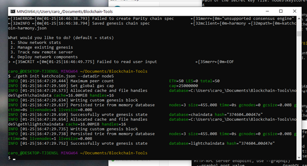
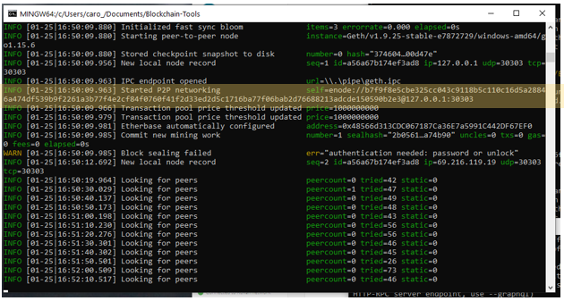
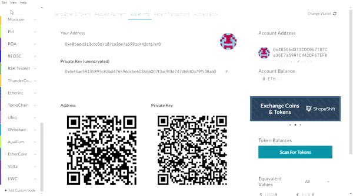
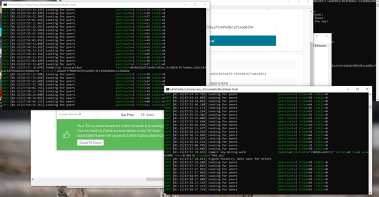

# katchcoin blockchain

On this repository, a set of instructions is presented to setup a private blockchain network to record transactions using Ethereum "logic" in a paper blockchain network named: katchcoin. This network uses `Proof of Authority` Consensus Algorithm.


## Setting Up the katchcoin Network:

The katchcoin network consists of 2 nodes (a mining node and a transactional node). 

&ensp; Mining node / Sender node (Node 5)

&ensp; Transactional node / Receiver node (Node 6)

Both nodes were created `genesis` using geth commands below, while the network was configured using puppeth.exe tool inside of the `Blockchain-Tools` folder.

&ensp; Genesis Commands:
```shell
    ./geth account new --datadir <node number>
```
Since, both nodes are already created and imported, there is no need to repeat the `genesis` stage. The Blockchain can be inititialized and run following the setps below:


step 1: Make sure that the following items are installed and running: (Mycrypto wallet[1] and blockchain genesis tools[2]). Ensure the blockchain genesis tool is Unzipped from the ethereum package and renamed as `Blockchain-Tools`

step 2: copy node5 and node6 from the repository Nodes folder into the `Blockchain-Tools` folder on C drive computer. Also, copy the Network `katchcoin.json` file (located in folder Blockchain_network folder) into the `Blockchain-Tools` folder on C drive.

step 3: Initiate each node. by typing the following command, node 5 is initialized:
```shell
./geth init katchcoin.json --datadir node5
``` 
Repeat the same command but change node5 with node6, to initialize the Transactional node (node6).

step 4: Run the mining node (node5), by typing the following command in the terminal: 
```shell
./geth --datadir node5 --unlock "<Public Address from Node5 Keystore>" --mine --rpc --allow-insecure-unlock
```


Once the mining node is running, copy the enode path (this information is needed to run the transactional node)



step 5: Run the Transactional node (node 6), by opening another terminal window and typing this command in the `Blockchain-Tools` folder:

```shell
./geth --datadir node6 --unlock "<Public Address from Node6 Keystore>" --mine --port 30304 --bootnodes enode://<Enode from Node5> --ipcdisable
```

The Transactional node must use a different port from the "mining" node, thus the port command 30304 must be specified to ensure that the port 30303 doesn't get reassigned.

## Configuring katchcoin network in MyCrypto wallet:

To be able to execute transactions, and while both nodes are running in their respective terminal windows, the crypto wallet needs to be configured with the `katchcoin` network. To configure the network in the wallet: open MyCrypto and create a custom node called: `katchcoin`, network name: `katchcoin`, with Chain ID `333`, and URL: `http://127.0.0.1:8545`. Refer to attached video for the configuration.




## Executing Transactions with katchcoin network:


Once the network is setup in the wallet and while the two nodes are running on their windows, the system is ready to operate.

To demonstrate that the katchcoin network is functional, a big transaction (50,000,000,000,000 ETH) was initiated from node 5 to node 6 with the objective of identifying the balance change from the sender node (node5).

To complete the transaction, open the wallet using the the `Private Key` option and paste the private key. Below are the details of both nodes.

 
<table>
  <tr>
    <td><font size="4">Node No. </font></td>
    <td><font size="4">Public Key </font></td>
    <td><font size="4">Private Key</font></td>
  </tr>
  <tr>
    <td><font size="2">Node 5</font></td>
    <td><font size="2">0x48566d313CDC067187Ca36E7a5991C442DF67EF0</font></td>
    <td><font size="2">0x6ef4ae58135895c82bd476596dcbe60366b007f3ac9f3d747db840a79f538ab0</font></td>
  </tr>
  <tr>
    <td><font size="2">Node 6</font></td>
    <td><font size="2">0xADf2f0601CbfdFAd30171F1B9d6dB1BcCA3Ba6ee</font></td>
    <td><font size="2">0xc943af37754fc653b7087f3562a52941f41c72a77b439427a5501bb9d9e210a8</font></td>
  </tr>
</table>

 Alternatively, the private key can be obtained by opening the wallet using `Keystore File` option and selecting the keystore folder located inside each node folder. Once there, reveal the private keys for the node that will be authorizing transactions, node 5 (this is required in order to authorize transactions).

Once the transaction is sent out, observe the terminal screens. The image below shows both nodes running and "signalling" the transaction is executed.



Additionally, this transaction stage can be confirmed in the Crypto Wallet, as the status of the transaction appears  `pending` confirming that the network katchcoin is functional.


## Resources:

For installation of MyCrypto Wallet and ethereum commands, refer to:

[1] https://download.mycrypto.com/

[2] https://geth.ethereum.org/


